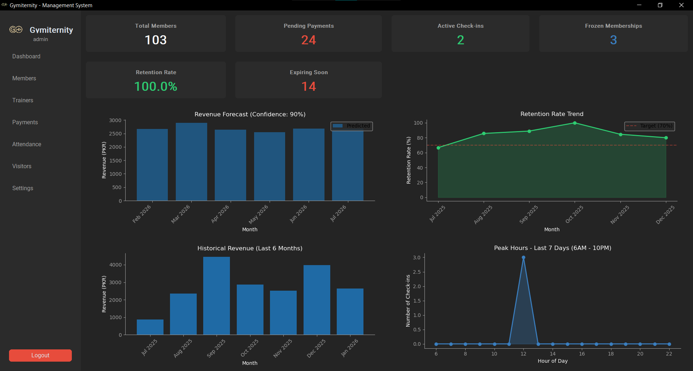
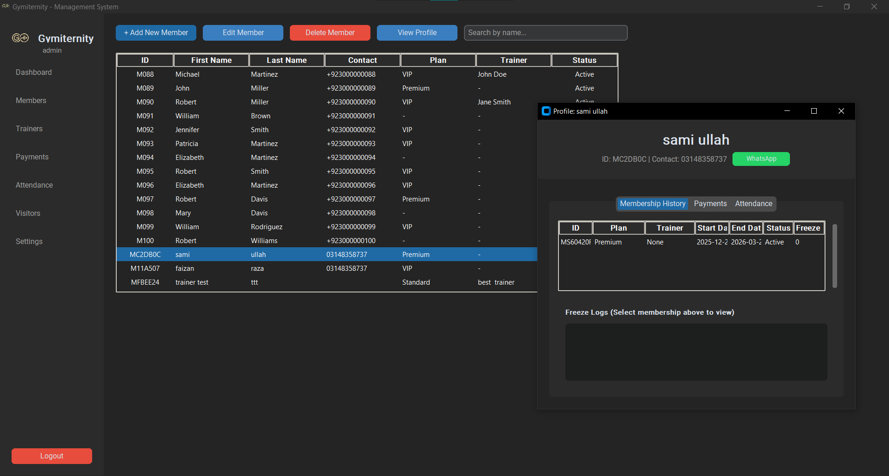
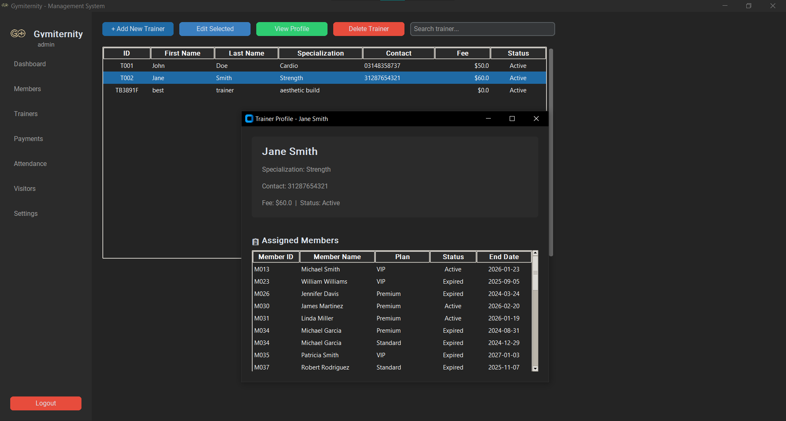
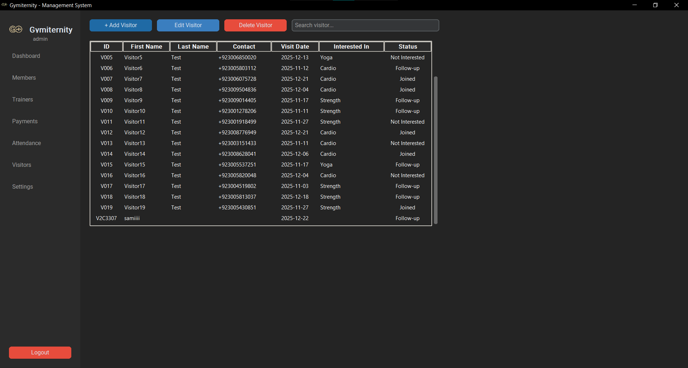
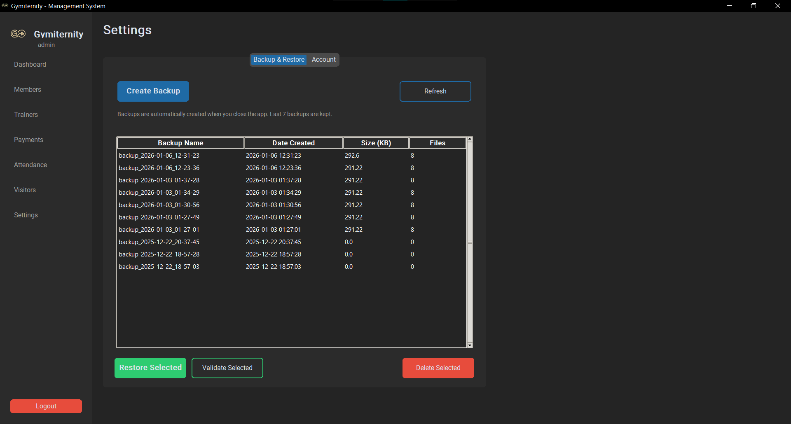

<p align="center">
  
</p>

<h1 align="center">Gymiternity</h1>

<p align="center">
  <strong>Gym Membership Management System</strong>
</p>

<p align="center">
  A sleek, feature-rich desktop application for managing gym operations — members, trainers, payments, attendance, and more.
</p>

<p align="center">
  
  
  
</p>

---

## ✨ Features

### 📊 Dashboard
Real-time analytics with revenue forecasts, retention trends, peak hours visualization, and active check-ins monitoring.

### 👥 Member Management
Complete member lifecycle management — add, edit, view profiles, manage memberships with freeze/unfreeze capabilities.

### 🏋️ Trainer Management
Manage trainers with input validation and view their assigned members via dedicated trainer profiles.

### 💳 Payment Tracking
Smart invoice management with automatic sorting (unpaid first), payment status tracking, and WhatsApp reminders.

### 📅 Attendance System
Efficient check-in/check-out system with daily activity monitoring and duration tracking.

### 👀 Visitor Management
Track leads and follow-ups, convert prospects to members seamlessly.

### 🔐 Security & Backup
- Secure login with case-insensitive usernames
- Automatic backups with one-click restoration
- Data persistence via JSON files

---

## 📸 Screenshots

### Login
<p align="center">
  
</p>

### Dashboard
<p align="center">
  
</p>

### Members
<p align="center">
  
</p>

### Trainers
<p align="center">
  
</p>

### Visitors
<p align="center">
  
</p>

### Settings
<p align="center">
  
</p>

---

## 🚀 Getting Started

### Prerequisites

- Python 3.x
- pip (Python package manager)

### Installation

1. **Clone the repository**
   ```bash
   git clone https://github.com/samiternity/Gym-Membership-Management-System.git
   cd Gym-Membership-Management-System
   ```

2. **Create a virtual environment** (recommended)
   ```bash
   python -m venv .venv
   
   # Windows
   .venv\Scripts\activate
   
   # macOS/Linux
   source .venv/bin/activate
   ```

3. **Install dependencies**
   ```bash
   pip install -r requirements.txt
   ```

### Running the Application

```bash
python -m src.main
```

### Default Credentials

| Username | Password |
|----------|----------|
| `admin`  | `admin123` |

---

## 📁 Project Structure

```
Gymiternity/
├── src/
│   ├── ui/                    # UI Modules
│   │   ├── dashboard.py       # Analytics dashboard
│   │   ├── members.py         # Member management
│   │   ├── trainers.py        # Trainer management
│   │   ├── payments.py        # Payment tracking
│   │   ├── attendance.py      # Check-in/out system
│   │   ├── visitors.py        # Lead management
│   │   ├── settings.py        # Backup & account settings
│   │   └── login.py           # Authentication UI
│   ├── analytics.py           # Revenue & retention analytics
│   ├── data_manager.py        # Data persistence layer
│   ├── auth_manager.py        # User authentication
│   ├── backup_manager.py      # Backup handling
│   ├── whatsapp_helper.py     # WhatsApp integration
│   ├── app.py                 # Main application window
│   └── main.py                # Entry point
├── data/                      # JSON data files (auto-created)
├── pics/                      # Screenshots and logos
└── requirements.txt           # Python dependencies
```

---

## 🛠️ Tech Stack

| Technology | Purpose |
|------------|---------|
| **Python 3.x** | Core programming language |
| **CustomTkinter** | Modern dark-themed UI framework |
| **Matplotlib** | Charts and data visualization |
| **Tkinter** | Native widgets (Treeview tables) |
| **Pillow** | Image processing |

---

## 📄 License

This project is for **educational purposes**.

